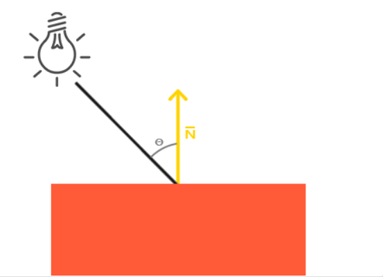
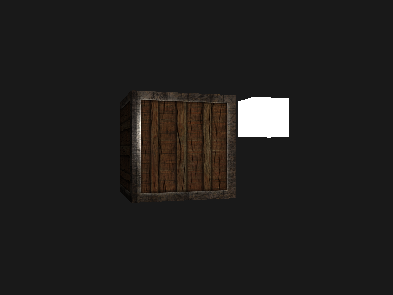

#### 颜色

光源照射到物体上，一部分颜色被吸收，另一部分无法吸收的被反射到人眼，于是呈现出了颜色。

当我们把光源的颜色与物体的颜色值`相乘`（而不是点乘），所得到的就是这个物体所反射的颜色。由此，我们可以定义物体的颜色为物体从一个光源反射各个颜色分量的大小。

要知道，两个向量的点乘结果是一个标量，在GLSL中两个向量相乘使用`A * B`，得到的是一个向量，即各个分量相乘的结果，而在GLSL中的点乘是`dot(A, B)`，这个得到的是标量。

#### 基础光照

##### 冯氏光照模型(Phong Lighting Model)

由3个分量组成：环境(Ambient)、漫反射(Diffuse)和镜面(Specular)光照。


- 环境光照(Ambient Lighting)：即使在黑暗的情况下，世界上通常也仍然有一些光亮（月亮、远处的光），所以物体几乎永远不会是完全黑暗的。为了模拟这个，我们会使用一个环境光照常量，它永远会给物体一些颜色。
- 漫反射光照(Diffuse Lighting)：模拟光源对物体的方向性影响(Directional Impact)。它是冯氏光照模型中视觉上最显著的分量。物体的某一部分越是正对着光源，它就会越亮。
- 镜面光照(Specular Lighting)：模拟有光泽物体上面出现的亮点。镜面光照的颜色相比于物体的颜色会更倾向于光的颜色。

##### 环境关照

光通常都不是来自于同一个光源，而是来自于我们周围分散的很多光源，即使它们可能并不是那么显而易见。光的一个属性是，它可以向很多方向发散并反弹，从而能够到达不是非常直接临近的点。所以，光能够在其它的表面上**反射**，对一个物体产生间接的影响。考虑到这种情况的算法叫做全局照明(Global Illumination)算法，但是这种算法既开销高昂又极其复杂。

由于我们现在对那种又复杂又开销高昂的算法不是很感兴趣，所以我们将会先使用一个简化的全局照明模型，即环境光照。正如你在上一节所学到的，我们使用一个很小的常量（光照）颜色，添加到物体片段的最终颜色中，这样子的话即便场景中没有直接的光源也能看起来存在有一些发散的光。

把环境光照添加到场景里非常简单。我们用光的颜色乘以一个很小的常量环境因子，再乘以物体的颜色，然后将最终结果作为片段的颜色：

```go
#version 410
    
out vec4 frag_colour;

uniform vec3 lightColor;
uniform vec3 objectColor;

void main() {
    float ambientStrength = 0.1;
    vec3 ambient = ambientStrength * lightColor;
    frag_colour = vec4(ambient * objectColor, 1.0);
}
```

##### 漫反射光照

环境光照本身不能提供最有趣的结果，但是漫反射光照就能开始对物体产生显著的视觉影响了。漫反射光照使物体上与光线方向越接近的片段能从光源处获得更多的亮度。



我们知道两个单位向量的夹角越小，它们点乘的结果越倾向于1。当两个向量的夹角为90度的时候，点乘会变为0。这同样适用于θθ，θθ越大，光对片段颜色的影响就应该越小。

关于向量的 [点乘](https://learnopengl-cn.github.io/01%20Getting%20started/07%20Transformations/)

点乘得到的是标量，我们可以用它计算光线对片段颜色的影响。不同片段朝向光源的方向的不同，这些片段被照亮的情况也不同。

所以，计算漫反射光照需要什么？

- 法向量：一个垂直于顶点表面的向量。
- 定向的光线：作为光源的位置与片段的位置之间向量差的方向向量。为了计算这个光线，我们需要光的位置向量和片段的位置向量。

法向量是一个垂直于顶点表面的（单位）向量。由于顶点本身并没有表面（它只是空间中一个独立的点），我们利用它周围的顶点来计算出这个顶点的表面。我们能够使用一个小技巧，使用叉乘对立方体所有的顶点计算法向量，但是由于3D立方体不是一个复杂的形状，所以我们可以简单地把法线数据手工添加到顶点数据中。

计算每一个顶点漫反射光，我们需要知道以下数据：

- 光源的位置：固定值，通过uniform传入
- 每一个顶点在世界坐标系中的位置：将Model矩阵乘以顶点的原始坐标，而不是经过投影和视角转换之后的`gl_Position`，这一点需要注意，因为光源和物体的位置是固定的，每个顶点算出来的光线值就是固定的，它不会随着投影和视角的变换而变化。
- 每一个顶点的（单位）法向量的值：暂时手动填入到顶点属性中。

接下来计算光源到顶点的向量

```go
vec3 norm = normalize(Normal);
vec3 lightDir = normalize(lightPos - FragPos);
```

当计算光照时我们通常不关心一个向量的模长或它的位置，我们只关心它们的方向。所以，几乎所有的计算都使用单位向量完成，因为这简化了大部分的计算（比如点乘）。所以当进行光照计算时，确保你总是对相关向量进行标准化，来保证它们是真正地单位向量。忘记对向量进行标准化是一个十分常见的错误。

下一步，我们对`norm`和`lightDir`向量进行点乘，计算光源对当前片段实际的漫反射影响。结果值再乘以光的颜色，得到漫反射分量。两个向量之间的角度越大，漫反射分量就会越小：

```go
float diff = max(dot(norm, lightDir), 0.0);
vec3 diffuse = diff * lightColor;
```

最后跟环境光相加

```go
frag_colour = vec4((ambient + diffuse) * objectColor, 1.0);
```


最后还有一个问题，顶点的坐标是乘以了Model矩阵，但是法向量却没有做处理，也就是说法向量并没有转换到世界空间中来，这一块的原理比较复杂，可以 [查看](https://learnopengl-cn.github.io/02%20Lighting/02%20Basic%20Lighting/)，结论就是：

```go
fNormal = mat3(transpose(inverse(model))) * vNormal;
```

矩阵求逆是一项对于着色器开销很大的运算，因为它必须在场景中的每一个顶点上进行，所以应该尽可能地避免在着色器中进行求逆运算。以学习为目的的话这样做还好，但是对于一个高效的应用来说，你最好先在CPU上计算出法线矩阵，再通过uniform把它传递给着色器（就像模型矩阵一样）。

```go
normalModel := model1.Inv().Transpose().Mat3()

gl.UniformMatrix3fv(gl.GetUniformLocation(program1, gl.Str("normalModel\x00")), 1, false, &normalModel[0])
```

效果没什么差别，这是因为我们没有对物体进行任何缩放操作，所以我们并不真的需要使用一个法线矩阵，而是仅以模型矩阵乘以法线就可以。但是如果你会进行不等比缩放，使用法线矩阵去乘以法向量就是必须的了。

##### 镜面光照

和漫反射光照一样，镜面光照也决定于光的方向向量和物体的法向量，但是它也决定于观察方向，例如玩家是从什么方向看向这个片段的。镜面光照决定于表面的反射特性。如果我们把物体表面设想为一面镜子，那么镜面光照最强的地方就是我们看到表面上反射光的地方。


我们通过根据法向量翻折入射光的方向来计算反射向量。然后我们计算反射向量与观察方向的角度差，它们之间夹角越小，镜面光的作用就越大。由此产生的效果就是，我们看向在入射光在表面的反射方向时，会看到一点高光。

观察向量是我们计算镜面光照时需要的一个额外变量，我们可以使用观察者的世界空间位置和片段的位置来计算它。之后我们计算出镜面光照强度，用它乘以光源的颜色，并将它与环境光照和漫反射光照部分加和。

我们选择在世界空间进行光照计算，但是大多数人趋向于更偏向在观察空间进行光照计算。在观察空间计算的优势是，观察者的位置总是在(0, 0, 0)，所以你已经零成本地拿到了观察者的位置。然而，若以学习为目的，我认为在世界空间中计算光照更符合直觉。如果你仍然希望在观察空间计算光照的话，你需要将所有相关的向量也用观察矩阵进行变换（不要忘记也修改法线矩阵）。

要得到观察者的世界空间坐标，我们直接使用摄像机的位置向量即可。

首先，我们定义一个镜面强度(Specular Intensity)变量，给镜面高光一个中等亮度颜色，让它不要产生过度的影响。如果我们把它设置为1.0f，我们会得到一个非常亮的镜面光分量，这对于一个珊瑚色的立方体来说有点太多了。

下一步，我们计算视线方向向量，和对应的沿着法线轴的反射向量：

```go
vec3 viewDir = normalize(viewPos - FragPos);
vec3 reflectDir = reflect(-lightDir, norm);
```

需要注意的是我们对`lightDir`向量进行了取反。`reflect`函数要求第一个向量是**从**光源指向片段位置的向量，但是`lightDir`当前正好相反，是从片段**指向**光源（由先前我们计算`lightDir`向量时，减法的顺序决定）。为了保证我们得到正确的`reflect`向量，我们通过对`lightDir`向量取反来获得相反的方向。第二个参数要求是一个法向量，所以我们提供的是已标准化的`norm`向量。

计算镜面分量：

```go
float spec = pow(max(dot(viewDir, reflectDir), 0.0), 32);
vec3 specular = specularStrength * spec * lightColor;
```

我们先计算视线方向与反射方向的点乘（并确保它不是负值），然后取它的32次幂。这个32是高光的反光度(Shininess)。一个物体的反光度越高，反射光的能力越强，散射得越少，高光点就会越小。在下面的图片里，你会看到不同反光度的视觉效果影响：


在光照着色器的早期，开发者曾经在顶点着色器中实现冯氏光照模型。在顶点着色器中做光照的优势是，相比片段来说，顶点要少得多，因此会更高效，所以（开销大的）光照计算频率会更低。然而，顶点着色器中的最终颜色值是仅仅只是那个顶点的颜色值，片段的颜色值是由插值光照颜色所得来的。结果就是这种光照看起来不会非常真实，除非使用了大量顶点。


在顶点着色器中实现的冯氏光照模型叫做Gouraud着色(Gouraud Shading)，而不是冯氏着色(Phong Shading)。记住，由于插值，这种光照看起来有点逊色。冯氏着色能产生更平滑的光照效果。


完整代码

```go
package light

// 光照

import (
	"runtime"

	"github.com/go-gl/gl/v4.1-core/gl"
	"github.com/go-gl/glfw/v3.2/glfw"
	"github.com/go-gl/mathgl/mgl32"
	"github.com/phprao/go-graphic/util"
)

const (
	width  = 800
	height = 600

	vertexShaderSource = `
	#version 410

	in vec3 aPos;
	in vec3 aNormal;

	out vec3 FragPos;
	out vec3 Normal;

	uniform mat4 model;
	uniform mat4 view;
	uniform mat4 projection;
	uniform mat3 normalModel;

	void main() {
		Normal = normalModel * aNormal;
		FragPos = vec3(model * vec4(aPos, 1.0));
		gl_Position = projection * view * model * vec4(aPos, 1.0);
	}
	` + "\x00"

	fragmentShaderSource = `
	#version 410
    
	out vec4 frag_colour;

	in vec3 Normal;
	in vec3 FragPos;

	uniform vec3 lightPos;
	uniform vec3 viewPos;
	uniform vec3 lightColor;
	uniform vec3 objectColor;

	void main() {
		// 环境光
		float ambientStrength = 0.1;
		vec3 ambient = ambientStrength * lightColor;

		// 漫反射光
		vec3 norm = normalize(Normal);
		vec3 lightDir = normalize(lightPos - FragPos);
		float diff = max(dot(norm, lightDir), 0.0);
		vec3 diffuse = diff * lightColor;

		// 镜面光
		float specularStrength = 0.5;
		vec3 viewDir = normalize(viewPos - FragPos);
		vec3 reflectDir = reflect(-lightDir, norm);
		float spec = pow(max(dot(viewDir, reflectDir), 0.0), 32);
		vec3 specular = specularStrength * spec * lightColor;

		frag_colour = vec4((ambient + diffuse + specular) * objectColor, 1.0);
	}
	` + "\x00"

	vertexShaderSource2 = `
	#version 410

	in vec3 aPos;

	uniform mat4 model;
	uniform mat4 view;
	uniform mat4 projection;

	void main() {
		gl_Position = projection * view * model * vec4(aPos, 1.0);
	}
	` + "\x00"

	fragmentShaderSource2 = `
	#version 410
    
	out vec4 frag_colour;

	void main() {
		frag_colour = vec4(1.0);
	}
	` + "\x00"
)

var (
	vertices = []float32{
		-0.5, -0.5, -0.5, 0.0, 0.0, -1.0,
		0.5, -0.5, -0.5, 0.0, 0.0, -1.0,
		0.5, 0.5, -0.5, 0.0, 0.0, -1.0,
		0.5, 0.5, -0.5, 0.0, 0.0, -1.0,
		-0.5, 0.5, -0.5, 0.0, 0.0, -1.0,
		-0.5, -0.5, -0.5, 0.0, 0.0, -1.0,

		-0.5, -0.5, 0.5, 0.0, 0.0, 1.0,
		0.5, -0.5, 0.5, 0.0, 0.0, 1.0,
		0.5, 0.5, 0.5, 0.0, 0.0, 1.0,
		0.5, 0.5, 0.5, 0.0, 0.0, 1.0,
		-0.5, 0.5, 0.5, 0.0, 0.0, 1.0,
		-0.5, -0.5, 0.5, 0.0, 0.0, 1.0,

		-0.5, 0.5, 0.5, -1.0, 0.0, 0.0,
		-0.5, 0.5, -0.5, -1.0, 0.0, 0.0,
		-0.5, -0.5, -0.5, -1.0, 0.0, 0.0,
		-0.5, -0.5, -0.5, -1.0, 0.0, 0.0,
		-0.5, -0.5, 0.5, -1.0, 0.0, 0.0,
		-0.5, 0.5, 0.5, -1.0, 0.0, 0.0,

		0.5, 0.5, 0.5, 1.0, 0.0, 0.0,
		0.5, 0.5, -0.5, 1.0, 0.0, 0.0,
		0.5, -0.5, -0.5, 1.0, 0.0, 0.0,
		0.5, -0.5, -0.5, 1.0, 0.0, 0.0,
		0.5, -0.5, 0.5, 1.0, 0.0, 0.0,
		0.5, 0.5, 0.5, 1.0, 0.0, 0.0,

		-0.5, -0.5, -0.5, 0.0, -1.0, 0.0,
		0.5, -0.5, -0.5, 0.0, -1.0, 0.0,
		0.5, -0.5, 0.5, 0.0, -1.0, 0.0,
		0.5, -0.5, 0.5, 0.0, -1.0, 0.0,
		-0.5, -0.5, 0.5, 0.0, -1.0, 0.0,
		-0.5, -0.5, -0.5, 0.0, -1.0, 0.0,

		-0.5, 0.5, -0.5, 0.0, 1.0, 0.0,
		0.5, 0.5, -0.5, 0.0, 1.0, 0.0,
		0.5, 0.5, 0.5, 0.0, 1.0, 0.0,
		0.5, 0.5, 0.5, 0.0, 1.0, 0.0,
		-0.5, 0.5, 0.5, 0.0, 1.0, 0.0,
		-0.5, 0.5, -0.5, 0.0, 1.0, 0.0,
	}
)

func Run() {
	runtime.LockOSThread()
	window := util.InitGlfw(width, height, "light")
	defer glfw.Terminate()

	pointNum := int32(len(vertices)) / 5

	program1, _ := util.InitOpenGL(vertexShaderSource, fragmentShaderSource)
	vao1 := util.MakeVaoWithAttrib(program1, vertices, nil, []util.VertAttrib{{Name: "aPos", Size: 3}, {Name: "aNormal", Size: 3}})
	program2, _ := util.MakeProgram(vertexShaderSource2, fragmentShaderSource2)
	vao2 := util.MakeVaoWithAttrib(program2, vertices, nil, []util.VertAttrib{{Name: "aPos", Size: 3}, {Name: "aNormal", Size: 3}})

	gl.ClearColor(0.1, 0.1, 0.1, 1.0)
	gl.Enable(gl.DEPTH_TEST)

	lightPos := mgl32.Vec3{2, 0, 0}
	lightColor := mgl32.Vec3{1, 1, 1}
	objectColor := mgl32.Vec3{1, 0.5, 0.31}

	cameraPos := mgl32.Vec3{0, 0, 3}
	cameraFront := mgl32.Vec3{0, 0, -1}
	cameraUp := mgl32.Vec3{0, 1, 0}

	camera := util.NewCamera(cameraPos, cameraFront, cameraUp, width, height)
	camera.SetCursorPosCallback(window)

	for !window.ShouldClose() {
		gl.Clear(gl.COLOR_BUFFER_BIT | gl.DEPTH_BUFFER_BIT)
        
         // lightPos = mgl32.Vec3{2, float32(math.Sin(glfw.GetTime())), 0}

		// 画箱子
		gl.UseProgram(program1)

		gl.Uniform3fv(gl.GetUniformLocation(program1, gl.Str("lightColor\x00")), 1, &lightColor[0])
		gl.Uniform3fv(gl.GetUniformLocation(program1, gl.Str("lightPos\x00")), 1, &lightPos[0])
		gl.Uniform3fv(gl.GetUniformLocation(program1, gl.Str("objectColor\x00")), 1, &objectColor[0])
		gl.Uniform3fv(gl.GetUniformLocation(program1, gl.Str("viewPos\x00")), 1, &camera.CameraPos[0])
		view := camera.LookAt()
		projection := camera.Perspective()

		model1 := mgl32.Ident4()
		normalModel := model1.Inv().Transpose().Mat3()
		gl.UniformMatrix4fv(gl.GetUniformLocation(program1, gl.Str("model\x00")), 1, false, &model1[0])
		gl.UniformMatrix4fv(gl.GetUniformLocation(program1, gl.Str("view\x00")), 1, false, &view[0])
		gl.UniformMatrix4fv(gl.GetUniformLocation(program1, gl.Str("projection\x00")), 1, false, &projection[0])
		gl.UniformMatrix3fv(gl.GetUniformLocation(program1, gl.Str("normalModel\x00")), 1, false, &normalModel[0])
		gl.BindVertexArray(vao1)
		gl.DrawArrays(gl.TRIANGLES, 0, pointNum)

		// 画光源
		gl.UseProgram(program2)
		model2 := mgl32.Translate3D(lightPos.X(), lightPos.Y(), lightPos.Z()).Mul4(mgl32.Scale3D(0.2, 0.2, 0.2))
		gl.UniformMatrix4fv(gl.GetUniformLocation(program2, gl.Str("model\x00")), 1, false, &model2[0])
		gl.UniformMatrix4fv(gl.GetUniformLocation(program2, gl.Str("view\x00")), 1, false, &view[0])
		gl.UniformMatrix4fv(gl.GetUniformLocation(program2, gl.Str("projection\x00")), 1, false, &projection[0])
		gl.BindVertexArray(vao2)
		gl.DrawArrays(gl.TRIANGLES, 0, pointNum)

		glfw.PollEvents()
		window.SwapBuffers()
	}
}
```

我们也可以使光源动态移动起来，观察一下，有利于理解冯氏光照模型。

总结一下：环境光好理解；漫反射光是由物体和光源的相对位置决定的；镜面光是由物体，光源，相机三者的相对位置决定的。

#### 材质(Material)

当描述一个表面时，我们可以分别为三个光照分量定义一个材质颜色(Material Color)：环境光照(Ambient Lighting)、漫反射光照(Diffuse Lighting)和镜面光照(Specular Lighting)。通过为每个分量指定一个颜色，我们就能够对表面的颜色输出有细粒度的控制了。现在，我们再添加一个反光度(Shininess)分量，结合上述的三个颜色，我们就有了全部所需的材质属性了：

```go
struct Material {
    vec3 ambient; // 环境光颜色
    vec3 diffuse; // 漫反射光颜色
    vec3 specular; // 镜面光颜色
    float shininess; // 镜面光的反光度
}; 

uniform Material material;
```

我们为冯氏光照模型的每个分量都定义一个颜色向量。ambient材质向量定义了在环境光照下这个表面反射的是什么颜色，通常与表面的颜色相同。diffuse材质向量定义了在漫反射光照下表面的颜色。漫反射颜色（和环境光照一样）也被设置为我们期望的物体颜色。specular材质向量设置的是表面上镜面高光的颜色（或者甚至可能反映一个特定表面的颜色）。最后，shininess影响镜面高光的散射/半径。

[devernay.free.fr ](http://devernay.free.fr/cours/opengl/materials.html) 中的一个表格展示了一系列材质属性，它们模拟了现实世界中的真实材质。

搞清楚一个物体正确的材质设定是个困难的工程，这主要需要实验和丰富的经验。用了不合适的材质而毁了物体的视觉质量是件经常发生的事。

有了材质颜色之后，我们就不需要再传入物体的颜色了。

```go
#version 410

out vec4 frag_colour;

in vec3 Normal;
in vec3 FragPos;

uniform vec3 lightPos;
uniform vec3 viewPos;
uniform vec3 lightColor;

struct Material {
    vec3 ambient;
    vec3 diffuse;
    vec3 specular;
    float shininess;
}; 

uniform Material material;

void main() {
    // 环境光
    vec3 ambient = lightColor * material.ambient;

    // 漫反射光
    vec3 norm = normalize(Normal);
    vec3 lightDir = normalize(lightPos - FragPos);
    float diff = max(dot(norm, lightDir), 0.0);
    vec3 diffuse = lightColor * diff * material.diffuse;

    // 镜面光
    vec3 viewDir = normalize(viewPos - FragPos);
    vec3 reflectDir = reflect(-lightDir, norm);
    float spec = pow(max(dot(viewDir, reflectDir), 0.0), material.shininess);
    vec3 specular = lightColor * spec * material.specular;

    frag_colour = vec4(ambient + diffuse + specular, 1.0);
}
```

传值

```go
gl.Uniform3f(gl.GetUniformLocation(program1, gl.Str("material.ambient\x00")), 1, 0.5, 0.31)
gl.Uniform3f(gl.GetUniformLocation(program1, gl.Str("material.diffuse\x00")), 1, 0.5, 0.31)
gl.Uniform3f(gl.GetUniformLocation(program1, gl.Str("material.specular\x00")), 0.5, 0.5, 0.5)
gl.Uniform1f(gl.GetUniformLocation(program1, gl.Str("material.shininess\x00")), 32)
```


#### 光的属性

上面的物体实在太亮了，我们还需要为环境光，漫反射光，镜面光分别设置颜色。

```go
#version 410
    
out vec4 frag_colour;

in vec3 Normal;
in vec3 FragPos;

uniform vec3 viewPos;

struct Material {
    vec3 ambient;
    vec3 diffuse;
    vec3 specular;
    float shininess;
}; 

uniform Material material;

struct Light {
    vec3 position;

    vec3 ambient;
    vec3 diffuse;
    vec3 specular;
};

uniform Light light;

void main() {
    // 环境光
    vec3 ambient = light.ambient * material.ambient;

    // 漫反射光
    vec3 norm = normalize(Normal);
    vec3 lightDir = normalize(light.position - FragPos);
    float diff = max(dot(norm, lightDir), 0.0);
    vec3 diffuse = light.diffuse * diff * material.diffuse;

    // 镜面光
    vec3 viewDir = normalize(viewPos - FragPos);
    vec3 reflectDir = reflect(-lightDir, norm);
    float spec = pow(max(dot(viewDir, reflectDir), 0.0), material.shininess);
    vec3 specular = light.specular * spec * material.specular;

    frag_colour = vec4(ambient + diffuse + specular, 1.0);
}
```

```go
gl.Uniform3f(gl.GetUniformLocation(program1, gl.Str("light.ambient\x00")), 0.2, 0.2, 0.2)
gl.Uniform3f(gl.GetUniformLocation(program1, gl.Str("light.diffuse\x00")), 0.5, 0.5, 0.5)
gl.Uniform3f(gl.GetUniformLocation(program1, gl.Str("light.specular\x00")), 1, 1, 1)
gl.Uniform3fv(gl.GetUniformLocation(program1, gl.Str("light.position\x00")), 1, &lightPos[0])
```


#### 不同的光源颜色

上面我们已经将光的各个分量拆分了出来，我们可以通过改变这些分量来改变光的颜色，已达到不同的效果。

#### 光照贴图

就是纹理贴图加光照的效果。

##### 漫反射贴图

此处将漫反射贴图（Diffuse Map）来替换掉漫反射光。它是一个表现了物体所有的漫反射颜色的纹理图像。

在着色器中使用漫反射贴图的方法和纹理教程中是完全一样的。但这次我们会将纹理储存为Material结构体中的一个`sampler2D`。我们将之前定义的`vec3`漫反射颜色向量替换为漫反射贴图。

我们也移除了环境光材质颜色向量，因为环境光颜色在几乎所有情况下都等于漫反射颜色，所以我们不需要将它们分开储存，不要忘记将环境光的材质颜色设置为漫反射材质颜色同样的值。


##### 镜面光贴图

就是将镜面光也添加上贴图。

我们认为箱子中间的木头是不会反射光线的，因此在第二张贴图上将木头部分置为黑色。

以下是添加了漫反射贴图和镜面贴图的效果。



#### 光源

##### 1、平行光/定向光

当一个光源处于很远的地方时，来自光源的每条光线就会近似于互相平行。当我们使用一个假设光源处于**无限**远处的模型时，它就被称为定向光，因为它的所有光线都有着相同的方向，它与光源的位置是没有关系的。定向光非常好的一个例子就是太阳。


因为所有的光线都是平行的，所以物体与光源的相对位置是不重要的，因为对场景中每一个物体光的方向都是一致的。由于光的位置向量保持一致，场景中每个物体的光照计算将会是类似的。

我们可以定义一个光线方向向量而不是位置向量来模拟一个定向光。着色器的计算基本保持不变，但这次我们将直接使用光的direction向量而不是通过position来计算lightDir向量。

```go
#version 410

......

struct Light {
    vec3 direction;

    vec3 ambient;
    vec3 diffuse;
    vec3 specular;
};

uniform Light light;

void main() {
    ......
    vec3 lightDir = normalize(-light.direction);
    ......
    frag_colour = vec4(ambient + diffuse + specular, 1.0);
}
```

```go
// 取反之后为照射方向，也就是说此时是从 Z=1 照射到 z=0
lightDirection := mgl32.Vec3{0, 0, -1}
```

我们让照射光的方向动态变化

```go
lightDirection = mgl32.Vec3{0, float32(math.Sin(glfw.GetTime())), -1}
```


##### 2、点光源

定向光对于照亮整个场景的全局光源是非常棒的，但除了定向光之外我们也需要一些分散在场景中的点光源(Point Light)。点光源是处于世界中某一个位置的光源，它会朝着所有方向发光，但光线会随着距离逐渐衰减。想象作为投光物的灯泡和火把，它们都是点光源。


在之前的教程中，我们一直都在使用一个（简化的）点光源。我们在给定位置有一个光源，它会从它的光源位置开始朝着所有方向散射光线。然而，我们定义的光源模拟的是永远不会衰减的光线，这看起来像是光源亮度非常的强。在大部分的3D模拟中，我们都希望模拟的光源仅照亮光源附近的区域而不是整个场景。

如果你将10个箱子加入到上一节光照场景中，你会注意到在最后面的箱子和在灯面前的箱子都以相同的强度被照亮，并没有定义一个公式来将光随距离衰减。我们希望在后排的箱子与前排的箱子相比仅仅是被轻微地照亮。

###### 衰减

随着光线传播距离的增长逐渐削减光的强度通常叫做衰减(Attenuation)。随距离减少光强度的一种方式是使用一个线性方程。这样的方程能够随着距离的增长线性地减少光的强度，从而让远处的物体更暗。然而，这样的线性方程通常会看起来比较假。在现实世界中，灯在近处通常会非常亮，但随着距离的增加光源的亮度一开始会下降非常快，但在远处时剩余的光强度就会下降的非常缓慢了。所以，我们需要一个不同的公式来减少光的强度。


`d`表示距离，其他参数都是系数设置。


##### 3、聚光

我们要讨论的最后一种类型的光是聚光(Spotlight)。聚光是位于环境中某个位置的光源，它只朝一个特定方向而不是所有方向照射光线。这样的结果就是只有在聚光方向的特定半径内的物体才会被照亮，其它的物体都会保持黑暗。聚光很好的例子就是路灯或手电筒。

